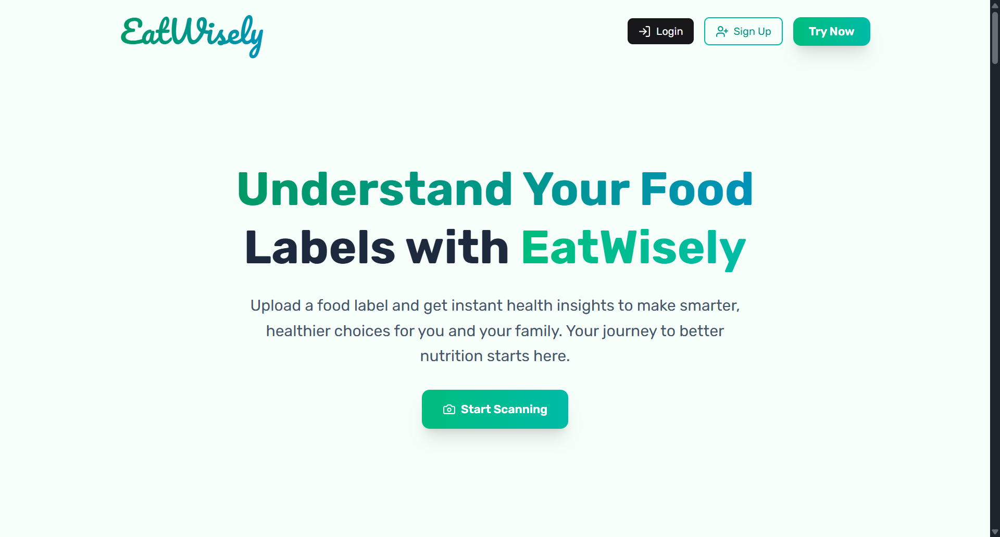
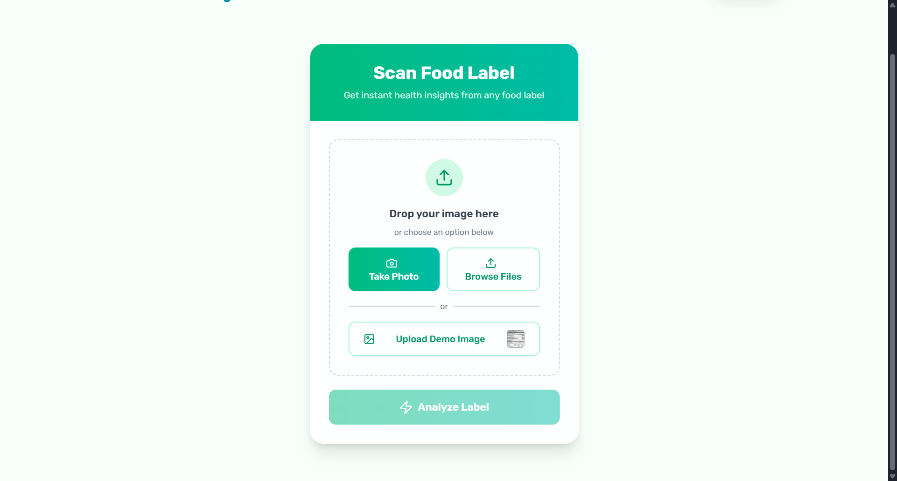

# EatWisely - Frontend

EatWisely is a health-conscious application that helps users scan food labels, analyze ingredients using AI, and keep track of scanned items with an intuitive and responsive UI.






## 🚀 Live Demo

[https://eatwisely.vercel.app](https://eatwisely.vercel.app)

## ✨ Features

* User Authentication (Login / Signup)
* OCR-based food label scanning
* Ingredient analysis with Google Gemini AI
* Scan history and detailed views
* Responsive UI with animations
* Toast notifications and error handling
* Feedback submission

## 🧑‍💻 Tech Stack

* React 18
* Vite
* Tailwind CSS + DaisyUI
* Redux Toolkit
* Firebase (for storage)
* Axios for API requests
* React Router DOM
* Framer Motion + GSAP
* React GA4 (Analytics)

## 📁 Project Structure

```
src/
├── Layout/
├── pages/
│   ├── Home.jsx
│   ├── Login.jsx
│   ├── Signup.jsx
│   ├── ProfilePage.jsx
│   ├── Scan.jsx
│   ├── ScanHistory.jsx
│   └── ScanDetail.jsx
├── redux/
│   └── slices/
├── App.jsx
├── main.jsx
```

## 🧭 Routes

| Path            | Component       | Protected |
| --------------- | --------------- | --------- |
| `/`             | HomePage        | No        |
| `/login`        | Login           | No        |
| `/signup`       | Signup          | No        |
| `/profile`      | ProfilePage     | Yes       |
| `/scan`         | ScanPage        | Yes       |
| `/scan-history` | ScanHistory     | Yes       |
| `/scan/:scanId` | ScanDetailsPage | Yes       |

## 📦 Installation

```bash
git clone https://github.com/himanshusharma2007/eatwisely-frontend
cd eatwisely-frontend
npm install
npm run dev
```

## 🤝 Contributions

Feel free to fork and raise a pull request!

## 📄 License

MIT
